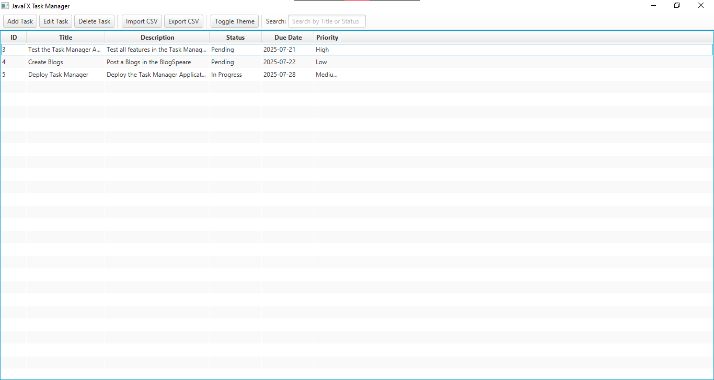
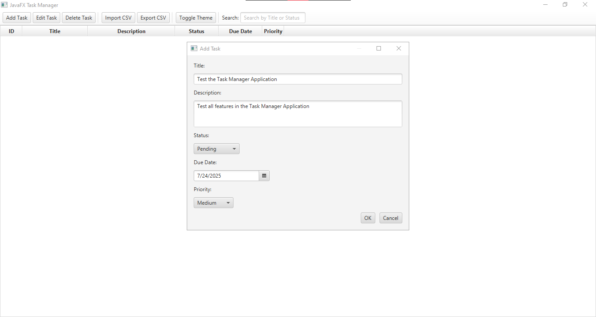
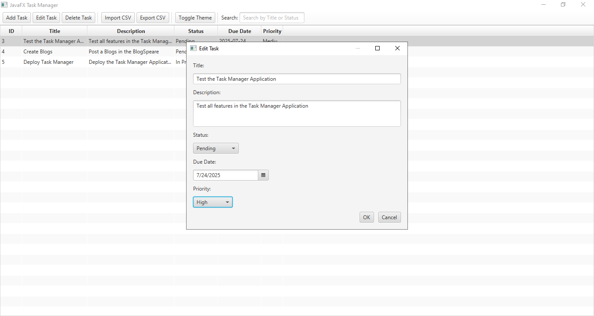
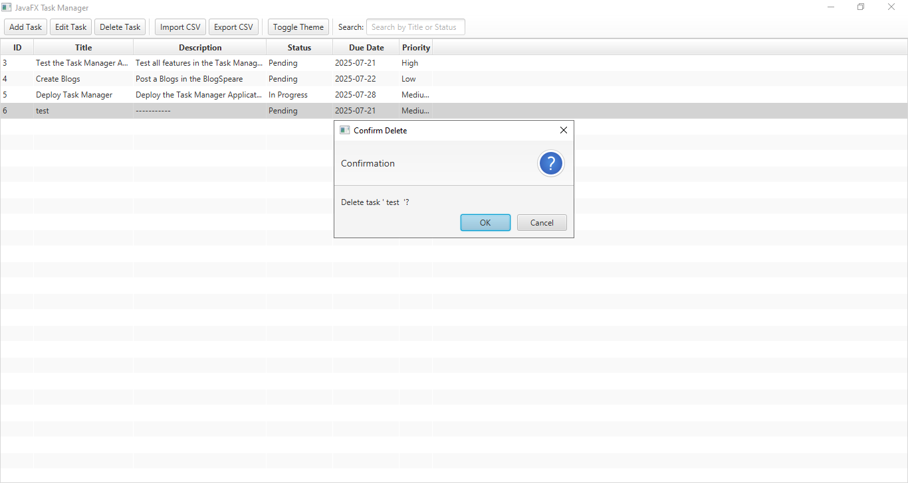
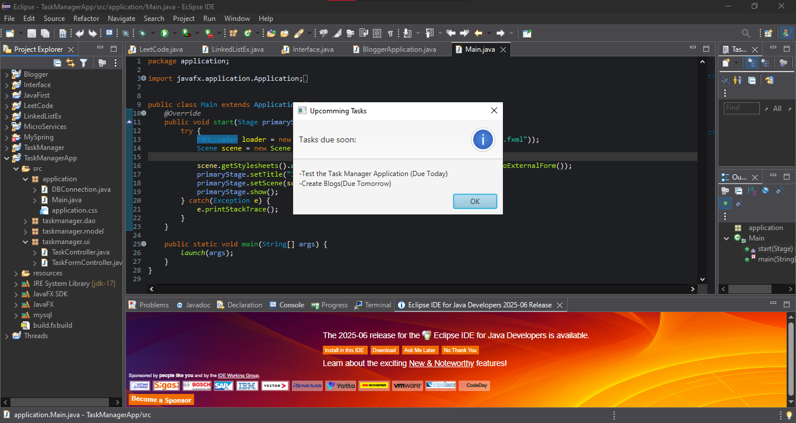
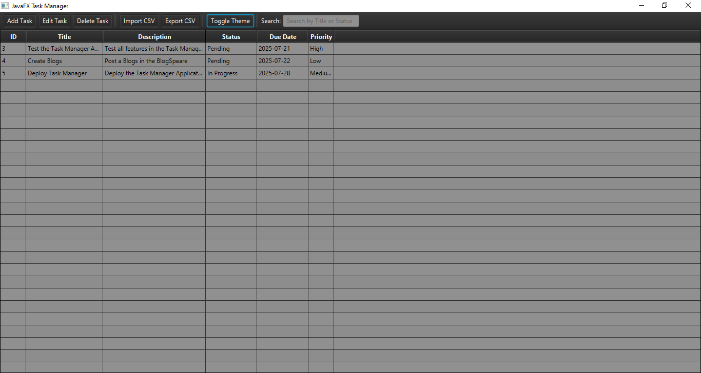

## JavaFX Task Manager Application

- A desktop-based Task Manager built using **JavaFX**, **JDBC**, and **MySQL**.
This application allows users to manage their daily tasks by adding, editing,
deleting, and tracking task progress with features such as due dates, priorities,
and real-time nitifications for upcoming tasks.
---
### Features
- Add, Edit, Delete Tasks
- Set Due Date adn Priority
- Track Task Status (Pending, In Progress, Completed)
- Light and Dark Theme Toggle
- Notifies when a task is due today
- Persistent storage with MySQL
- Clean and user-friendly interface with JavaFX

---
### 🖼️ Screenshots

### Task Manager View


### Add Task


### Edit Task


### Delete Task


### Notification Alert


### Toggle Theme


---

### Database Setup

- Run the following SQL to create the required table:

```sql
CREATE TABLE tasks (
id INT AUTO_INCREMENT PRIMARY KEY,
title VARCHAR(255) NOT NULL,
description TEXT,
status VARCHAR(50),
due_date DATE,
priority VARCHAR(50)
created_at TIMESTAMP DEFAULT
CURRENT_TIMESTAMP
);
```
---

### REQUIREMENTS
- Java 17+
- JavaFX SDK 17+
- MySQL Server
- Eclipse IDE (or VS Code with JavaFX plugins)

---
### 👨‍🎓 Author
- Kumaresan D


